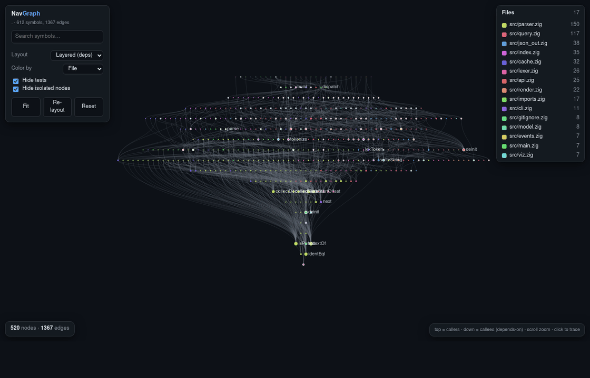

# NavGraph

**A code graph for your repository.**

<p align="center">
  
</p>
<p align="center">
  <sub><b><code>navgraph graph src &gt; graph.html</code></b> — the whole codebase as one interactive, dependency-layered page (callers → callees, top-down). Click a symbol to trace it. <a href="#visualize-the-graph">Details ↓</a></sub>
</p>

NavGraph indexes your codebase and answers precise structural questions —
who calls this, what does this touch, what breaks if I change it — instead of
grep-and-hope. It tracks definitions, call edges, and blast radius across 13
languages (Zig, C/C++, C#, Java, Python, JavaScript, TypeScript, TSX, Lua, Go,
Rust, Ruby), and ships as one dependency-free static binary. Use it from a
terminal, from Neovim, or from an AI agent — same commands, same answers.
<!-- navgraph-supported-languages: zig,c,cpp,csharp,python,javascript,typescript,tsx,lua,go,rust,ruby,java -->

## 60-second quickstart

Download the latest release (swap `x86_64-linux` for `aarch64-linux`,
`x86_64-macos`, or `aarch64-macos` to match your machine):

```sh
curl -LO https://github.com/mengsig/NavGraph/releases/latest/download/navgraph-x86_64-linux.tar.gz
curl -LO https://github.com/mengsig/NavGraph/releases/latest/download/SHA256SUMS
sha256sum --ignore-missing -c SHA256SUMS   # macOS: shasum -a 256 --ignore-missing -c SHA256SUMS
tar xzf navgraph-x86_64-linux.tar.gz
mkdir -p ~/.local/bin && install navgraph-x86_64-linux/navgraph ~/.local/bin/navgraph   # any dir on your PATH
```

`SHA256SUMS` has one entry per archive; `--ignore-missing` skips the three you
didn't download. It covers corruption, not authenticity — the file is unsigned
and served from the same origin as the tarball.

Now point it at a repo. There's no separate "build the index" step — the
first command does it and caches the result:

```
$ navgraph status
index root: .
snapshot: 50 files, 3911 symbols
cache: loaded=false, entries=0, hits=0/50, rewrite=written
freshness: current
... (plus a parse/resolution health dump)
```

Find a symbol:

```
$ navgraph search usageCommand
fn usageCommand (w: *std.Io.Writer, name: []const u8) !bool  src/cli.zig:235-329
test usageCommand renders concise registry-derived argument and option help  src/cli.zig:1323-1349
```

See who calls it:

```
$ navgraph callers usageCommand
fn usageCommand (w: *std.Io.Writer, name: []const u8) !bool  src/cli.zig:235-329
  test usageCommand renders concise registry-derived argument and option help  src/cli.zig:1323-1349  ↳:1329,1343
  fn main (init: std.process.Init) !void  src/main.zig:21-156  ↳:72
```

Ask what a change would break — every test that transitively reaches
anything changed since a git ref (`affected`, alias `impact`):

```
$ navgraph affected --since HEAD~2
test typed agent decoder constructs canonical read-only requests  src/agent_api.zig:1122-1130
test capability manifest is valid, self-identifying JSON  src/capabilities.zig:471-500
test schema fingerprint is the exact canonical emitted contract  src/capabilities.zig:502-514
...
… 106 nodes elided (limit; 300 shown)
```

That's the loop: index once (automatic), then `search` / `def` / `calls` /
`callers` / `affected` and the rest of the 43 commands in [Usage](#usage)
below — `navgraph help <command>` prints full usage for any of them.

## Use it from Neovim

[epicenter.nvim](https://github.com/mengsig/epicenter.nvim) is the reference
Neovim client — install it and it wires up `navgraph lsp` plus pickers for
search, callers, and blast radius. Any editor with an LSP client works the
same way; see [Editor integration](#editor-integration) below for the raw
`vim.lsp.start` setup and what the resident server gives you.

## Use it from an AI agent

`navgraph mcp` (alias for `navgraph serve`) runs a long-lived MCP server over
stdio: an agent gets one compact, typed `navgraph.query` tool instead of
shelling out per command, with a `max_bytes` budget on every result so an
answer never blows a context window. `navgraph lsp` gives an editor the same
resident graph over LSP, re-indexing incrementally as you type. `serve`
holds a snapshot for the session instead — call the `navgraph.reload` tool
(or the `workspace/reload` JSON-RPC method) after external edits; see
[Limitations & roadmap](#limitations--roadmap). Point your agent's MCP
client config at `navgraph mcp` run over stdio, the same invocation shown
under [Examples](#examples):

```sh
navgraph serve -C .
```

## Doc map

- [docs/lsp.md](docs/lsp.md) — the full editor/LSP protocol: every method,
  its exact payload shape, and the concurrency model.
- [docs/accuracy.md](docs/accuracy.md) — how resolution accuracy is measured
  per language, and where it currently stands.
- [docs/backends.md](docs/backends.md) — the heuristic vs. tree-sitter parser
  backends: what each trades off and how to build with tree-sitter enabled.

## Visualize the graph

Turn the whole graph into a **standalone, offline HTML page** — the animation at
the top is NavGraph rendering *its own* source. It's a **layered dependency view**
(callers on top, callees below, edges flowing downward), with a force-directed
mode one click away. Zoom, pan, search, and **click any symbol to trace its
callers/callees**; nodes are sized by fan-in and colored by file. No server, no
CDN, no dependencies — the data *and* the renderer are inlined into one
self-contained file you can open (or email) anywhere.

```sh
navgraph graph src --no-tests > graph.html   # then open graph.html in a browser
navgraph graph                                # whole repo (tests hidden in the initial view)
navgraph graph -C src/lexer.zig > lexer.html  # scope to a single file
navgraph graph -j > graph.json                # raw {nodes, edges} model for other tools
navgraph graph -j -l 200                      # capped: `nodes_total` + `truncated` say what was withheld
```

> Tip: GitHub won't run the page's JavaScript inline, so a repo shows a
> screenshot/GIF like the one above — but the file itself is fully interactive the
> moment you open it locally.

## Build from source & tests

Prefer a release binary for normal use (see [Quickstart](#60-second-quickstart)
above). To build from source, you need Zig `0.16.0`:

```sh
zig build -Doptimize=ReleaseFast          # -> zig-out/bin/navgraph
zig build -Doptimize=ReleaseFast --prefix ~/.local   # installs to ~/.local/bin/navgraph
```

Run the tests:

```sh
zig build test --summary all       # unit + integration suite
zig build contract --summary all   # real CLI over every supported testenv file
zig build efficiency               # deterministic agent-context byte budgets
```

Identify a binary and negotiate its live contract without indexing a repository:

```sh
navgraph capabilities -j
navgraph version              # alias; emits the same JSON manifest
```

The manifest is `navgraph.capabilities.v1`. It includes the content-addressed
source fingerprint/build ID, protocol and schema versions, supported languages
and extensions, command-specific language overrides, canonical commands and
aliases, positional arguments, applicable options, output modes, hard
limit/byte-budget and source-cursor contracts,
ambiguity behavior, read/write classification, server/reload features, and known
trust limitations. Clients should negotiate this output instead of copying
the README or assuming that an executable at a familiar path matches a checkout.
The language list means symbol indexing, not universal feature parity: today the
manifest explicitly records the narrower `imports`/`importers` matrix, including
partial Rust (`mod`, not `use`) and Java support and unsupported C/C++/C#/Go.

Estimate test coverage — the fraction of `fn`/`method` symbols reachable in the
call graph from a test (kcov cannot read Zig 0.16's DWARF5, so there is no
line-coverage tool for this codebase; this is a dependency-free substitute):

```sh
navgraph coverage src            # per-file % + overall, computed natively
navgraph coverage src -j         # same, as JSON
```

## Usage

```
navgraph <command> [arg] [flags]
```

| Command            | Purpose                                                        |
|--------------------|---------------------------------------------------------------|
| `outline [path]`   | Outline symbols in a file/dir (default: the whole project).   |
| `def <name>`       | Show a definition. Supports `Parent.name` to disambiguate.    |
| `docs <name>`      | Show indexed leading docs/docstrings for matching definitions. |
| `calls <name>`     | Tree of what `<name>` calls/uses (callees).                   |
| `callers <name>`   | Tree of who calls/uses `<name>` (callers).                    |
| `search <pattern>` | Symbols whose name contains `<pattern>` (`--refs` for use sites; `Recv.field`/`.field` pins attribute reads). |
| `routes [filter]`  | HTTP routes and cross-language client calls. Views: `--clients`, `--unhit`, `--orphan-calls` (`--orphan`/`--orphans`), `--handler <glob>`. Stacked and aliased FastAPI router prefixes are applied automatically; multiple router instances/mounts of one target file remain a declared trust limitation. |
| `conforms <selector>` | Audit Protocol/interface implementations or compare sibling classes/methods for missing, signature, and async divergence; every sibling verdict names its class and file. Aliases: `impls`, `implements`. |
| `hierarchy <Type>` | Nominal MRO/supertypes and transitive subtypes; `--overrides` includes the queried type and descendant override map. Alias: `hier`. |
| `raises <symbol>`  | Trace direct/transitive exception sites to their nearest matching handler or an unhandled gap. Alias: `throws`. |
| `catches <Error>`  | List matching handlers and handled/unhandled raise sites, including nominal subtype matches. Alias: `handles`. |
| `events [filter]`  | Link message-bus handlers to emitters by shared key, including Kafka consumer/producer topic expressions; common DOM/Leaflet `.on()` listeners are filtered. |
| `neighbors <name>` | Callees and callers of `<name>` in one view.                  |
| `unused [filter]`  | Unreferenced definitions (fns/methods & types) — removal candidates nothing calls or uses (**not** "broken" code). Default: truly unused (no caller in app or test code). `--no-tests` also lists code used only by tests (annotated); `--tests-only` lists unused test helpers; `--no-public` drops exported (maybe public API); `--follow-imports` disambiguates same-name symbols across packages by import reachability. |
| `imports [filter]` | Modules each file imports (local dependency edges).           |
| `importers <file>` | Files that import `<file>`.                                    |
| `path <A> <B>`     | Shortest call path from `<A>` to `<B>`.                        |
| `flow <symbol>`    | Directional data view: definition initializers and writers/producers versus readers/consumers; ambiguous selectors list the pinning syntax, and `--to <sink>` traces value handoffs. Alias: `dataflow`. |
| `taint <source>`   | Value-level source-to-sink reachability; requires `--to <sink>`, supports `@path` endpoint pinning, and reports exact/inferred/heuristic confidence. Alias: `security`. |
| `reaches <A,B,...>` | Deduplicated transitive closure from several roots; `--from-tests` instead selects tests that can reach any target. |
| `affected [ref]`   | Tests transitively affected by symbols changed since a git ref (`--since`, default `HEAD`). |
| `collisions [pattern]` | Group duplicate definition names and locations; `--members` includes methods/fields. Alias: `duplicates`. |
| `diff [ref]`       | Symbols changed since `<ref>` (default `HEAD`) plus their callers; `--exact-source` adds post-image byte ranges and the complete raw git patch. |
| `history <symbol>` | Symbol-range Git history and patches, bounded by `--last` (default 10). Alias: `hist`. |
| `blame <symbol>`   | Per-line author, commit, and summary provenance for a current symbol range. |
| `churn [path]`     | Rank current symbols by historical commits or added plus removed/replaced hunk lines (`--sort commits|lines`, `--last`, `--since`). |
| `hot [path]`       | Rank functions by fan-in/out (`←N callers →M callees`) — the load-bearing symbols; test-dominated results hint at `--no-tests`. Returns the top 25 unless `-l N` asks for more. |
| `files [filter]`   | Indexed files + symbol counts; `--sort symbols` ranks biggest-first. |
| `status [filter]`  | Index/cache snapshot, changed-since-build files, skipped paths, parse health, and unresolved/external graph-reference diagnostics. |
| `read <file[:A-B]>`| Paged numbered source; ranges are validated/merged, `-l` and hard `--budget` bound pages, and `--after <next>` resumes. |
| `strings <pattern>`| Search inside string literals (URLs, log/error text, regexes). |
| `todos [path]`     | Find `TODO`/`FIXME`/`HACK` markers in real comment tokens. |
| `edits <symbol>`   | List exact definition and resolved-reference edit sites, with source offsets. |
| `rename <sym> <new>` | Apply a collision-checked exact rename; `--preview` emits a unified patch without writing. |
| `coverage [path]`  | Per-file % of `fn`/`method` symbols reachable in the call graph from a test — a dependency-free, language-agnostic substitute for line coverage. |
| `graph [path]`     | **Interactive HTML** of the code graph (nodes = symbols, sized by fan-in, colored by file; edges = calls/type uses). Redirect stdout to a `.html` file and open it; `-j` emits the raw `{nodes, edges, nodes_total, truncated}` JSON. `-l` caps the node set; the JSON reports the total and text says so on stderr. Respects `--tests`. |
| `hunks [ref]`      | Working change's hunks, blast radius and roots — `navgraph/impact` mirror. Default ref is `HEAD`, like `affected`/`diff`. `--limit`/`--offset` page the blast radius; `--depth`/`--direction` control the walk. |
| `context <symbol>` | One symbol's definition, callers/callees/types/tests in a single call, trimmed to `--budget` tokens — `navgraph/context` mirror. `--include` restricts sections (`callers,callees,types,tests,body`); `--offset` pages a budget-capped `callers` list. |
| `where <file:line>`| Symbol enclosing a 1-based `file:line`, plus its breadcrumb chain — `navgraph/where` mirror (stack traces, diff hunks). |
| `serve`            | Keep the index in memory and serve newline-delimited JSON-RPC/MCP; `navgraph.reload` / `workspace/reload` atomically refresh it. Alias: `mcp`. `navgraph.hunks`/`.context`/`.where` mirror the three commands above as MCP tools. |
| `lsp`              | Run as a resident **editor server** (LSP over stdio) that keeps the graph in memory — see [Editor integration](#editor-integration). |
| `help [command]`   | Show the full catalogue or concise registry-derived help for one command. |

**Flags**

Flags come in two classes. The **global-class** flags — `-v`, `-d`, `-C`, `-l`,
`-t`, `-s`, `-r`, `-j`, `--no-cache` — are accepted on every command, so a client
can append one standard flag set to any argv. A command that has no use for one
ignores it and says so on stderr, keeping exit 0; the authoritative per-command
list of flags that actually *do* something is `navgraph capabilities -j`
(`commands[].options`). Every other flag is command-specific and is a usage error
(exit 2) on a command that does not declare it. A format a command cannot emit
(`serve -j`, `def --jsonl`) is likewise an error, not an ignored flag.

| Flag                          | Meaning                                    |
|-------------------------------|--------------------------------------------|
| `-v, --verbosity <level>`     | `names` \| `sig` \| `doc` \| `full` (default `sig`). |
| `-d, --depth <N>`             | Graph depth for call walks, `neighbors`, and `raises` propagation (default `1`). |
| `-C, --root <path>`           | Index root: a directory, or a single file to scope to it (default `.`). |
| `-l, --limit <N>`             | Max results (default `300`; `hot`'s own default is `25`). The flag is explicit, not a sentinel: on `imports`/`importers`/`graph`/`hot` a value you give is a real cap — `300` included — and leaving it off keeps the first three unbounded and `hot` at 25. |
| `--budget <bytes>`            | On commands declaring this option, a hard serialized stdout ceiling (minimum 64 bytes); results are importance-ranked, compacted, and marked/cursored when truncated. On `context` specifically this is a *token* budget instead (default 2000; `0` means the default, not "no cap") — `navgraph/context`'s wire `budget`, not a byte ceiling. |
| `--include <a,b,…>`           | `context`: sections to compute (`callers,callees,types,tests,body`); default is every section, an explicit empty list computes none. |
| `--max-nodes <N>`             | Exact retained-node cap; `--summary` renders retained nodes at name detail and reports elision. |
| `--since <ref>`               | Git comparison ref for `affected` or the lower history bound for `churn`. |
| `--last <N>`                  | Commit bound for `history`/`churn` (default `10`). |
| `--from-tests`                | `reaches`: return tests that transitively reach any named target. |
| `--preview`                   | `rename`: emit warnings and unified patch without writing files. |
| `--exact-source`              | `diff`: include exact current-source byte ranges and the complete raw git patch. |
| `-k, --kind <k1,k2>`          | Restrict `outline`/`search` to kinds (`fn`, `struct`, …). |
| `-p, --vis <scope>`            | Visibility for `outline`/`search`/`def`: `public`, `private`, or `all` (default). Shortcuts: `--public`, `--private`, `--no-private`. |
| `-t, --tests <with\|without\|only>` | Unified test-scope for `outline`/`search`/`callers`/`hot`/`unused`: include tests (default), exclude (`--no-tests`), or only tests (`--tests-only`). A *test* is a Zig `test` block, a `test_*` function, or a file under a test dir. |
| `-r, --refs`                  | `search`: match use sites with `[w]`/`[r]` access tags; `calls`/`neighbors`: include var/const/field reads. |
| `-w, --writers` / `--readers` | Filter `flow` or `search --refs` by access direction. |
| `-u, --unread`                | Keep values that are written but never read. |
| `--on-type <Type>`            | Type-scope member hits using receiver bindings or constructor context. |
| `--to <sink>`                 | `flow`: trace a handoff; `taint`: required security sink selector. |
| `--overrides`                 | `hierarchy`: include per-method overrides for the queried type and its subtypes. |
| `--duplicates`                | `search`: group duplicate definitions instead of listing individual matches. |
| `--members`                   | `collisions`: include class/container members. |
| `-e, --exact`                 | `search`: name must equal the pattern (no substring hits). |
| `--no-recurse`                | `outline`/`files`/`status`: only files directly in the given dir, not subtrees. |
| `-s, --strict`                | Follow only exact edges (drop inferred/heuristic `?` edges, including structural implementation edges). |
| `-i, --impls`                 | On `calls`/`callers`/`neighbors`/`path`/`reaches`/`affected`, cross Protocol/interface ↔ implementation edges (`⇒impl`). |
| `--clients`                   | `routes`: show resolved client call sites, tagged by source language. |
| `--unhit`                     | `routes`: show only routes with no resolved client calls. |
| `--orphan-calls`              | `routes`: show client calls that match no indexed route. Aliases: `--orphan`, `--orphans`. |
| `--handler <glob>`            | `routes`: select routes by handler name. |
| `-j, --json`                  | Emit JSON (stable, for tooling/MCP).       |
| `--jsonl`                     | Stream one item per JSON line plus a page record. `--after v1:N` resumes from its stable ordinal cursor. Supported by `outline`, `search`, `hot`, `todos`, `reaches`, `affected`, `edits`, and `status`. |
| `--sort <key>`                | `files`: `path|symbols`; `outline`/`search`: `line|name|span|callers|callees`; `hot`: `fan_in|fan_in_exact|fan_out|fan_out_exact|span`; `churn`: `commits|lines`. Numeric metrics rank descending with stable path/line ties. |
| `--no-cache`                  | Ignore the `.navgraph/cache` and rebuild. Accepted by `read`, which never uses the cache either way. |
| `--no-public`                 | `unused`: drop exported symbols (possible public API). |
| `--follow-imports`            | `unused`: disambiguate same-name symbols by import reachability. |
| `--log <file>`                | `lsp`: write diagnostics to `<file>` (default: stderr).    |
| `--log-level <error\|info\|debug>` | `lsp`: diagnostic verbosity (default: `error`).    |

**Patterns.** A name or filter containing `*` is a glob: `def 'Ba*'` lists
`Bays` and `Bananas`, `search '*_handler'` anchors on the whole name,
`callers 'Matcher.is*'` walks every matching member. Path filters glob
gitignore-style — `files '*_test.py'` matches basenames at any depth,
`outline 'src/**/*.ts'` the full path. Without a `*`, names substring-match
(and `def` matches exactly), as before.

**Ignores.** `.gitignore` is respected everywhere. A `.navgraphignore`
(same syntax, per-directory) adds navgraph-only rules — scratch dirs, vendored
code, fixtures — without touching git; a negated rule (`!vendor/`) re-includes
a directory the built-in skip set would prune. Generated `.codeflow/` probe
artifacts are pruned by default. Minified/bundled artifacts (`*.min.*`,
one-enormous-line files) are skipped automatically and named in the skipped-note.

**Exit codes.** `0` = found results, `1` = the query ran but found nothing
(grep convention), `2` = usage error. Piping into `head` exits quietly (141).
A not-found suggests near-miss names (`did you mean: …`); an ambiguous name
prints how many definitions matched and the `Parent.name` / `name@path` pin
syntax.

## Examples

Find the tests affected by a branch, or compute reachability from several roots:

```sh
navgraph affected --since HEAD~1
navgraph diff HEAD~1 --exact-source
navgraph reaches place_order,cancel
navgraph reaches place_order,cancel --from-tests --impls
```

With `diff --exact-source -j`, the legacy file array becomes `{files, patch}`.
Each post-image range carries exact `start`/`end` bytes and `source`; a
pure-deletion anchor has `empty: true`, equal byte offsets, and empty source,
while the raw patch preserves deleted files and removed text.

Bound a deep walk to agent context, then page a large result without losing your
place:

```sh
navgraph calls negotiate -d 3 --max-nodes 40 --summary
navgraph outline packages --budget 4000
navgraph search Handler --jsonl -l 100
navgraph search Handler --jsonl -l 100 --after v1:100
navgraph status --jsonl -l 100             # freshness + diagnostics
```

Preview a mechanical rename before applying it, and inspect intent comments:

```sh
navgraph edits FeasibilityProvider.check
navgraph rename FeasibilityProvider.check evaluate --preview
navgraph rename FeasibilityProvider.check evaluate
navgraph docs FeasibilityProvider.check
navgraph todos adapters/
```

A rename is applied only when the selector resolves to one definition, every
selected site is exact and offset-validated, and the destination does not collide
in the affected file/container or with a local binding. Exact Protocol method
counterparts are included. Heuristic/unrecoverable sites block application and
stay visible for review.

Run the long-lived MCP surface over stdio:

```sh
navgraph serve -C .
```

It implements `initialize`, `tools/list`, `tools/call`, and
`workspace/reload` using one JSON-RPC 2.0 object per line. Agents should use the
compact, typed, read-only `navgraph.query` tool. Its six operations are `map`,
`symbol`, `relations`, `source`, `impact`, and `diagnostics`; `max_bytes` hard-
bounds the complete structured result envelope, which consistently reports
snapshot identity, exactness, ambiguity candidates, truncation/continuation,
health, items/source spans, warnings, and ready-to-call suggestions.
Edit-site spans are individually marked exact/editable; omitted heuristic or
unrecoverable occurrences are counted as review gaps and downgrade completeness.
Array-like map, diagnostics, edit-site, and affected-test results accept
`after: "v1:N"`; `next` is a directly runnable query. Diagnostics also offers a
focused `likely_local` view instead of forcing agents through expected externals.

The full manifest remains available through `navgraph/capabilities` and
`navgraph.capabilities` for client-side negotiation. The legacy raw-argv
`navgraph` tool remains temporarily available but is read-only; mutation is
rejected. `navgraph.reload` accepts `{"noCache":true}` and atomically swaps in a
fresh index only after the rebuild succeeds. A no-id `workspace/reload`
notification refreshes the snapshot without emitting a response.

`navgraph.hunks` (`{ref?, depth?, direction?, limit?, offset?}`),
`navgraph.context` (`{symbol, budget?, include?, offset?}`)
and `navgraph.where` (`{file, line}`) mirror the `hunks`/`context`/`where` CLI
verbs and `navgraph/impact`/`context`/`where`'s LSP wire shapes exactly — one
symbol's full context, the working change's hunks, or the symbol enclosing a
line, each in a single typed call. Each opens its own one-shot index per call
rather than reusing the server's resident one (see `docs/lsp.md`'s "1.1" CLI
and MCP mirrors section for why), so unlike `navgraph.query` above, a call
here costs a fresh walk.

Find who writes and reads a field, or trace the handoff to a sink:

```sh
navgraph flow Record.value
navgraph flow Record.value --to serialize
navgraph search value --refs --on-type Record --writers
```

Flow direction is captured per reference site. Module-level constant/variable
initializers are explicit producers, direct assignments and constructor keyword
labels are writes, augmented assignments are both read and write, and constructor
calls are producers for type symbols. If a selector matches several definitions,
the text view reports the exact match count and pin syntax; JSON includes every
candidate. Pin with `Parent.name` or `name@path`. For JSON, `--to` reports source
and sink candidates alongside `path`; `counts` are uncapped totals while
`emitted` and `truncated` describe the single global `-l` output budget.
Receiver type scoping uses existing annotations and local bindings;
dynamic/reflected receivers remain best-effort and unresolved edges are never
promoted to exact matches.

Inspect inheritance, failures, untrusted-input reachability, and Git provenance:

```sh
navgraph hierarchy Leaf --overrides
navgraph raises submit_order -d 3
navgraph catches OrderError --strict
navgraph taint request.json --to subprocess.run
navgraph taint request.json@routes.py --to subprocess.run --strict -j
navgraph history negotiate --last 10
navgraph blame negotiate
navgraph churn src --last 50 --sort lines
```

`hierarchy` derives nominal edges from Python, JS/TS, Java, C++, C#, Ruby, Go
embedded interfaces, and Rust trait implementations. Resolved local bases feed a
C3-style MRO; qualified, unresolved, or ambiguous external bases retain their
source spelling and stay marked as heuristic. If the queried type or a traversed
ancestor has one, text marks the MRO incomplete and JSON sets
`"mro_complete":false`. C++/C# name-only override candidates are heuristic and
are omitted by `--strict`.

`raises`/`catches` scan language exception constructs and propagate them over
resolved call sites. Ruby bare `rescue` means `StandardError`, while conditional
C# `catch ... when (...)` handlers are heuristic. Dynamic raised values and
matches through external built-in exception bases are also heuristic; `--strict`
drops heuristic call, raise, and handler edges.

`taint` builds a dedicated callable-local value graph for parameters, assignments,
returns, call arguments/results, and sink arguments. It is bounded, best-effort
static reachability, not a proof of exploitability: module-level/global flows,
alias-heavy member state, sanitizers, and full path-sensitive control flow are not modeled.
Use `@path` to pin an endpoint and inspect confidence on every edge; `--strict`
keeps only exact edges. Before applying `-l`, findings are ranked by confidence
(exact, inferred, heuristic), then shortest path distance and stable sink order;
the reachable count remains uncapped. JSON reports `analysis_complete:false` if
an indexed file has a tokenizer-desynchronization warning.

Git commands execute fixed argv arrays without a shell; patch-producing commands
disable configured external diff/textconv helpers, and diff parsing decodes Git
C-quoted paths. `history` and `blame` use the current working-tree symbol range
against Git, so uncommitted line shifts can change attribution. `churn` counts
added and removed/replaced hunk lines, maps them onto current symbol ranges, and
labels that ranking heuristic after moves or renames. Its JSON envelope is
`{entries,count,truncated,exact}`; `count` is the uncapped number of matching
symbols in the selected history window. An unborn Git repository produces an
empty churn ranking, while `history` and `blame` still report that no usable
history exists.

Rank the largest definitions and audit ambiguous names without shell pipelines:

```sh
navgraph outline src -k fn --sort span -l 10
navgraph hot src --sort fan_out_exact
navgraph collisions -k struct,fn
navgraph search Graph --duplicates
```

Outline a file at signature detail:

```
$ navgraph outline src/parser.zig -k fn,struct,method -l 5
# src/parser.zig (zig)
  struct ParsedSymbol  L24-53
  struct BodyInfo  L56-61
  struct Ctx  L65-96
    method Ctx.ch (self: *const Ctx, i: u32) u8  L79-82
    method Ctx.isPunct (self: *const Ctx, i: u32, c: u8) bool  L84-86
… (stopped at -l 5; raise it to see more)
```

Follow the call graph two levels deep (callees). Resolved edges recurse;
unresolved/external calls are summarised on a `~ ext:` line:

```
$ navgraph calls collectRefs -d 2 -l 3
fn collectRefs (ctx: *Ctx, params_open: u32, lo: u32, hi: u32, self_name: []const u8, kw: KeywordSet) !BodyInfo  src/parser.zig:593-693
  method Token.text (self: Token, source: []const u8) []const u8  src/lexer.zig:30-34  ↳:622 ?
    ~ ext: assert
  method Class.has (self: Class, c: u8) bool  src/lsp/regex.zig:73-75  ↳:626 ?
    ~ ext: @intCast
  ~ ext: assert, StringHashMap, keyIterator, next, free, deinit, ArrayList, deinit, deinit, deinit, deinit, deinit, dupe
(2 heuristic `?` edges shown — re-run with -s to drop them)
… 15 branches elided (--budget/--max-nodes; 3 nodes shown)
```

Who calls a symbol:

`emit` is ambiguous across files here; pin one with `name@path`:

```
$ navgraph callers 'emit@src/parser.zig' -l 3
fn emit (ctx: *Ctx, sym: ParsedSymbol) !u32  src/parser.zig:1583-1589
  fn emitRoute (ctx: *Ctx, rd: api.RouteDef, n: u32, prefixes: *const std.StringHashMap([]const u8)) !void  src/parser.zig:307-330  ↳:318
  fn emitMount (ctx: *Ctx, m: api.RouterMount, recv_i: u32) !void  src/parser.zig:336-359  ↳:346
… 49 branches elided (--budget/--max-nodes; 3 nodes shown)
```

Who implements a port, and which dispatch sites reach it:

```
$ navgraph callers Store.get --impls
method Store.get (...)  src/ports.py:8
  method MemoryStore.get (...)  src/memory.py:12  ⇒impl ?
```

Structural implementation edges are heuristic (`?`); explicit nominal
inheritance can be exact. `--strict` keeps only exact edges. The derived
implementation graph is query-local, so it does not inflate `hot`, `unused`, or
coverage.

Audit a Protocol or compare sibling classes selected by a glob:

```
navgraph conforms Store
navgraph conforms '*Runner' -j
```

`conforms` reports `OK`, `MISSING`, `SIG-DIFF`, and `ASYNC-DIFF`. A Protocol
selector compares its methods with discovered implementations; a selector that
matches multiple ordinary classes or methods produces a sibling divergence
matrix. Sibling rows identify the inspected class and file, and the expected
header definition is not repeated as an `ok` implementation row.

Inspect HTTP client coverage after mounted router prefixes are applied:

```
navgraph routes /v1/orders --clients
navgraph routes --unhit
navgraph routes --orphan-calls             # aliases: --orphan, --orphans
navgraph routes --handler 'place_*'
```

Visibility can be filtered without post-processing:

```
navgraph outline src --public
navgraph search '*_handler' --vis private
```

Show a full definition:

```
$ navgraph def bracketMatches -v full
fn bracketMatches  src/parser.zig:528-532
fn bracketMatches(open: u8, cl: u8) bool {
    return (open == '(' and cl == ')') or
        (open == '{' and cl == '}') or
        (open == '[' and cl == ']');
}
```

Cross-file resolution works out of the box; HTTP routes and events can also
bridge language families:

```
$ navgraph calls Server.start -C ./backend -d 2
method Server.start (self):  app/server.py:15
  fn load_config (path):  app/server.py:3
    fn parse (text):  app/server.py:8
    ~ ext: open, read
```

## Editor integration

`navgraph lsp` runs NavGraph as a long-lived editor server: a standard LSP
server (a subset) plus custom `navgraph/*` methods that expose the graph verbs.
The whole graph stays in memory, an edit re-indexes in tens of milliseconds or
less, and blast-radius / search / call-graph queries answer in single-digit
milliseconds.

```
navgraph lsp [-C|--root <dir>] [--log <file>] [--log-level error|info|debug]
```

- **Standard LSP** — `definition`, `references`, `hover`, `documentSymbol`,
  `workspace/symbol`, call/type hierarchy, `implementation`, `typeDefinition`,
  `documentHighlight`, `codeLens`, full document sync. An open buffer's unsaved
  text drives the graph, so answers reflect what you are typing, not what is
  on disk.
- **`navgraph/*`** — the full CLI verb set over the resident graph: `status`,
  `symbolAt`, `blast`, `impact`, `tests`, `types`, `context`, `where`,
  `search`, `grep`, `callers`, `calls`, `rescan`, `neighbors`, `path`,
  `outline`, `hot`, `unused`, `diff`, `routes`, `events`, `imports`,
  `importers`, `graph`, plus a `navgraph/indexed` notification after every
  re-index. `blast` is the one to reach for: the transitive callers (or
  callees) of a symbol, a file, or everything changed since a git ref — with a
  per-depth and per-file summary. `context` is the one to reach for from an
  editing agent: everything about one symbol in a single call, trimmed to a
  token budget.
- A background mtime poll picks up changes made outside the editor (a git
  checkout, a formatter) and re-indexes them.

Neovim, with the built-in client:

```lua
vim.lsp.start({
  name = "navgraph",
  cmd = { "navgraph", "lsp" },
  root_dir = vim.fs.root(0, { ".git", "build.zig" }),
})
```

Or use [epicenter.nvim](https://github.com/mengsig/epicenter.nvim), the
reference Neovim client: it wires up `navgraph lsp` plus pickers and views for
the custom `navgraph/*` methods (blast radius, search, the call graph, …) out
of the box.

Measured on this repo (ReleaseFast): initial index 36–46 ms cold / 14–16 ms
warm, single-file re-index 4–10 ms, search ~2 ms, grep ~3 ms, blast depth 3
0.1 ms; ~35 MB resident at 118k lines.

The full protocol — every method, its exact payload shapes, the concurrency
model, the measured numbers and the current limitations — is in
[`docs/lsp.md`](docs/lsp.md).

## How it works

1. **Walk** the project tree, skipping vendored/build dirs (`node_modules`,
   `.git`, `zig-out`, `__pycache__`, `dist`, `site-packages`, …) and any file or
   directory matched by a `.gitignore` (per-directory files, negation, and
   `*`/`**` globs). A **`.navgraphignore`** (same syntax, per-directory) adds
   navgraph-only rules on top — and a negated `!vendor/` rule there re-includes
   a directory the built-in skip set would prune.
2. **Tokenize** each file with a shared, language-configured lexer that
   correctly skips strings, comments, JavaScript regex literals, and JSX closing
   tags. If an unterminated string consumes the rest of a file, its parse-health
   range is cached, printed as a warning, and exposed in JSON/JSONL diagnostics.
3. **Extract** definitions and their in-body references with per-language
   heuristic scanners (no per-language grammar required).
4. **Resolve** references to definitions by name, with exact receiver-aware
   handling for `self`/`this`, typed receivers, and imported modules. Member calls
   are scoped to the enclosing or inferred receiver type; unknown receiver types
   remain external or heuristic rather than being attached to an unrelated
   same-named class. Build a reverse (callers) index.
5. **Render** query results in a dense, indentation-based format tuned for low
   token cost. Budgeted walks retain exact/high-fan-in branches first; JSONL
   pagination uses stable `v1:<ordinal>` cursors over deterministic result order.

Everything for one run lives in a single arena that is freed on exit.

## Backends

Step 3 above (**Extract**) runs one of two backends: the heuristic scanner
described here (no grammar required, always available), or an opt-in
tree-sitter backend (`-Dtree-sitter=<all|none|comma list>` at build time,
`--backend auto|heuristic|tree-sitter` at run time) that trades a slower cold
parse for grammar-accurate extraction on the languages it covers. See
`docs/backends.md` for the design, the offline-build story, and measured
numbers.

## Limitations & roadmap

- Resolution is **heuristic**, not compiler-grade. It is type-scoped (a member
  call binds only to a member of the receiver's inferred type — `self`/`this`,
  typed params including C-family `const Shape* s`, local `Foo{…}`/`Foo.init()`
  bindings, and fields of the enclosing type declared with one, such as Go
  `store store.Store` behind `a.store.Get()`) and import-aware, but a call on an
  untracked receiver falls back to a name match, marked heuristic (`?`);
  `--strict` drops those. A call never binds to a non-callable: a type is a call
  target only where the language spells construction as a call (Python/Ruby
  classes, C++/Java/C#/Rust constructors, JS factories), while a `var`/`const`
  stays legal because nothing here types values and a function-valued binding is
  genuinely callable. A Go conversion (`models.WidgetID(n)`) is recorded as a
  type use rather than a call. A local shadows a same-named package —
  `for _, store := range xs` binds `store.Get()` to the local, not to package
  `store` — and a bare qualifier that names a package/namespace resolves to that
  clause as an inferred edge, never an exact one. Import evidence only
  suppresses a name match for languages whose import forms are actually
  resolved — Rust `use` is unmodelled, so it does not. Treat the graph as
  high-recall guidance.
- `affected` and `reaches --from-tests` are structural call-graph impact, not
  runtime coverage. Dynamic dispatch still needs `--impls` or may remain unknown;
  pure deletions cannot be seeded from symbols absent from the current index.
- Rename intentionally refuses ambiguous selectors, destination collisions, and
  heuristic/unrecoverable use sites. It does not rewrite strings, comments,
  reflected names, or generated code. Project-wide writes are per-file rather
  than transactional, so use `--preview` and version control for multi-file edits.
- `serve` keeps a snapshot in memory. Use the `navgraph.reload` MCP tool or
  `workspace/reload` JSON-RPC method after external edits; rebuild failure leaves
  the previous index intact. JSONL cursors are stable only while that snapshot
  and the query options remain unchanged.
- Repeat runs are fast via an on-disk cache under `.navgraph/cache` (path +
  mtime + ctime + size keyed); `--no-cache` forces a clean rebuild.
- **Cross-language linking** covers HTTP routes (`navgraph routes`, e.g. a TS
  `fetch('/v1/route')` paired with a mounted Python/FastAPI handler) and
  message-bus events (`navgraph events`). Literal FastAPI `include_router`
  prefixes are resolved across imported modules before clients are linked;
  dynamic prefixes and ambiguous mounts are left unresolved rather than guessed.
  GraphQL / DB-model / protobuf schemas, and non-Zig
  *inline* tests (e.g. Rust `#[cfg(test)]`), are not yet handled.

See `ROADMAP.md` for planned work and `new-features.md` for the current backlog.

## Library use

The engine is exposed as a Zig module (`src/root.zig`) — `language`, `lexer`,
`model`, `parser`, `index`, `query`, `render`, `api`, `impls`, and related query
output modules — so it can be embedded directly.
